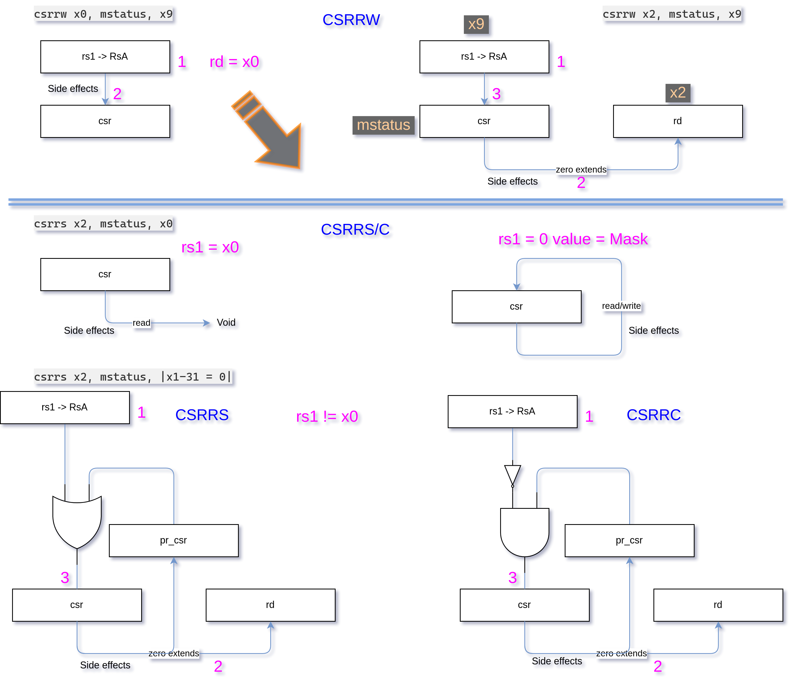

# RangerRisc-RISC-V Multicyle
Ranger Risc softcore SystemVerilog RISC-V Multicycle variant.

The video shows BlackiceEdge hosting RangerRisc. The softcore RISC-V assembly program is counting and displaying on the 7seg. The blade shows the interrupt count and the Blue LED flicking shows the interrupt signal.

On the upper PMOD is the Interrupt signal coming from the Pico RP2040. On the lower PMOD is the UART channel for talking to a UART client (written in Go.)


The repo contains two variations: a *debug* version with controls signals routed out via UART and a *release* version that is trimmed down.

**NOTE** This repo does **NOT** contain the *Simulation* code base. For simulation please see the [RISC-V-RV32I-MultiCycle](https://github.com/wdevore/RISC-V-RV32I-MultiCycle) repo under the *simulation* folder.

## Directories
- *assemblies* Contains all assembly code examples. Note most of them are *more* compatible with the 48Hz clock.
- *debug* Contains the *debug* variant which contains a bunch of exposed signals for displaying.
- *definitions* has common definitions
- *modules* has all the common modules
- *rams* generally contains only a single *code.ram* file
- *release* This the stripped down variant and can run about 1.23MHz faster
- *tools* contains two Go programs: an Assembler and UART client
  - gen-instr (i.e. the Assembler)
    - The assembly.json is configured for *release* variant.
  - go-uart (the UART client for talking with fpga)

Sometimes you need to re-upload the bitstream image for it to boot correctly.

## Debug version
The **Top** module contains a huge amount of code to support transmitting data from the fpga to a UART client. This includes UART, blade port and 7seg port.

It consumes about 3500 LUTs!:

```
Info: Max frequency for clock 'clk$SB_IO_IN_$glb_clk': 47.49 MHz (PASS at 18.00 MHz)
Info: Max frequency for clock    'cpu_clock_$glb_clk': 19.19 MHz (PASS at 18.00 MHz)

Info: Device utilisation:
Info: 	         ICESTORM_LC:  3501/ 7680    45%
Info: 	        ICESTORM_RAM:    12/   32    37%
Info: 	               SB_IO:    23/  256     8%
Info: 	               SB_GB:     7/    8    87%
Info: 	        ICESTORM_PLL:     1/    2    50%
Info: 	         SB_WARMBOOT:     0/    1     0%
```

## Release version
This version is trimmed down. It doesn't have UART or exposed core signals. This saves **905** LUTs.

Also, a slightly higher clock can be used resulting in a boost of: **1.23MHz**. Note however, the makefile is still configured for 18MHz.

This version is also *hardcoded* to **18MHz**, hence, make sure your assembly code compensates for the higher clock. For example, any counting code should have some form of delay added.

```
Info: Max frequency for clock 'clk$SB_IO_IN_$glb_clk': 197.75 MHz (PASS at 18.00 MHz)
Info: Max frequency for clock    'clk_18MHz_$glb_clk': 20.42 MHz (PASS at 18.00 MHz)

Info: Device utilisation:
Info: 	         ICESTORM_LC:  2596/ 7680    33%
Info: 	        ICESTORM_RAM:    12/   32    37%
Info: 	               SB_IO:    21/  256     8%
Info: 	               SB_GB:     7/    8    87%
Info: 	        ICESTORM_PLL:     1/    2    50%
Info: 	         SB_WARMBOOT:     0/    1     0%
```

# Terminal #1 minicom
This terminal is for connecting to the Pico using:

```minicom -b 115200 -o -D /dev/ttyUSB0```

Once the Pico has been programmed with the control software via *build/io_uart*. You can use "h" or "l" for manual high/low control of the active pin. Or you can use "t" to toggle the active pin.


# Terminal #2 go-uart
This terminal is for talking to the fpga's UART module. The two most commonly used commands are "s" and "c" or "k" (48Hz) or "l" (18MHz).


# Hardware rig
Up top is the Pico for generating an interrupt on Pin 15 which is routed to the left pmod.

On the right pmod is the UART connections for talking between the fpga and the Go control program.


# Logical Layout diagram


# Core FSM


# CSRs


# Test harness during Synthesis


# Usage
Super high level usage guide:

1) Program the Pico and connect the Pico's UART and
2) Connect Pin 15 to the left fpga pmod
3) Connect second USB-UART to fpga via pmods (on the right).
4) Connect fpga to USB. The BlackiceEdge shows up as ttyACM0
5) cd into RangerRisc-RISC-V<...> and run ```make```
6) go to the *go-uart* bin directory and run ```go run .```
7) use the commands to direct the fpga top module
8) use minicom to direct the pico to toggle a pin to generate interrupts.

## Assembly
Nihongo/Hardware/Risc-v/TopReference/risc-v-asm-manual.pdf

### Notes:
The instructions themselves need to have the offset specified in byte-address form, however, the memory addresses can be defined as byte-address using "$" or word-address using "@".

If an instruction references an address that is defined in word-address form then it is converted to byte-address form even if it refers to a word-address. This is per the RISC-V ISA specs.

## Setup and running programs
You need to do several things in order for the cpu to run code on the FPGA. Open 3 terminals: one for the assembler, another for HDL toolchain and another for the go UART client.

1) Create or modify your ```<file>.asm``` program and make sure you update the assembler's assembly.json file. The assemlby files are typically stored in the *assemblies* under the application root folder.
2) Open a terminal and *cd* to *\<path to\>/tools/gen-instr/assembler* folder
3) Run the assembler ```go run . <file>.asm``` to produce the *code.ram* file that is embedded into the fpga bit stream via the ```$readmemh``` command.
4) Open another terminal and *cd* to *\<path to\>/Synthesis/ranger_risc* folder and run ```make```.
5) Open another terminal and *cd* to *\<path to\>/tools/go-uart* and run ```go run .```

### Assembler json
update the *inputPath* and *inputFile* keys to the .asm file you are targeting. Also, update the *RamDir* to direct the assembled ram code to a destination.

Then run ```go run .``` or ```go run . <file>.asm```

### Example assembly code
```
Main: @
    lw x1, 0x28(x0)     // 0x28 BA = 0x0A WA
    ebreak              // Stop

Data: @00A
    d: DEADBEEF         // data to load

RVector: @0C0           // 0x300 BA = 0xC0 WA
    @: Main             // Reset vector
```

The *RVector*'s value is what is defined in the makefile entry:

```RESET_BOOT_VECTOR = "32'h00000300" # @0C0```

After running the assembler you get a helpful yet extra *code.out* for cross reference:

```
@00000000 02802083 lw x1, 0x28(x0)     // 0x28 BA = 0x0A WA
@00000001 00100073 ebreak              // Stop
@0000000A DEADBEEF d: DEADBEEF         // data to load
@000000C0 00000000 @: Main             // Reset vector
```

# Makefile
There are two ways we can setup a macro for injecting dynamic definitions in verilog code. I prefer #1.

1) Create a file, for example, **definitions.sv** with a ``` `define ROM_PATH "../rams/"```
2) Or, add a variable and macro definition to a makefile:
```Makefile
CODE_PATH = "\"../rams/\""
...
	-DRAMROM_PATH=${CODE_PATH} \
```
Then define a **localparam** as: ```localparam RomPath = `RAMROM_PATH;``` some place you need it, for example, memory.sv.

Here is an example:
```Makefile
CODE_PATH = "\"../rams/\""

.PHONY: all

all: build route upload

compile: build route

build: ${MODULES_FILES} ${PINS_CONSTRAINTS}
	@echo "##### Building..."
	${ICESTORM_TOOLCHAIN}/bin/yosys -p ${YOSYS_COMMAND} \
	-l ${BUILD_BIN}/yo.log \
	-q \
	-defer \
	-DRESET_VECTOR=${RESET_BOOT_VECTOR} \
	-DRAMROM_PATH=${CODE_PATH} \
	-DUSE_ROM \
	-DDEBUG_MODE \
	${MODULES_FILES}
```

# PLLs
Folknology has an excellent page for describing how to use the <span style="color: blue;">*simple mode*</span> capability of the lattice iCE40 fpga: https://github.com/mystorm-org/BlackIce-II/wiki/PLLs

We need an ~18MHz clock because nextpnr has trouble routing anything faster. So we use *icepll* to generate our control parameters:

```icepll -i 25 - o 18```

This will generate:
```
F_PLLIN:    25.000 MHz (given)
F_PLLOUT:   18.000 MHz (requested)
F_PLLOUT:   17.969 MHz (achieved)

FEEDBACK: SIMPLE
F_PFD:   25.000 MHz
F_VCO:  575.000 MHz

DIVR:  0 (4'b0000)
DIVF: 22 (7'b0010110)
DIVQ:  5 (3'b101)

FILTER_RANGE: 2 (3'b010)
```

However, *icepll* can also generate example code too:

```icepll -i 25 -o 18 -m -f pll.v```
